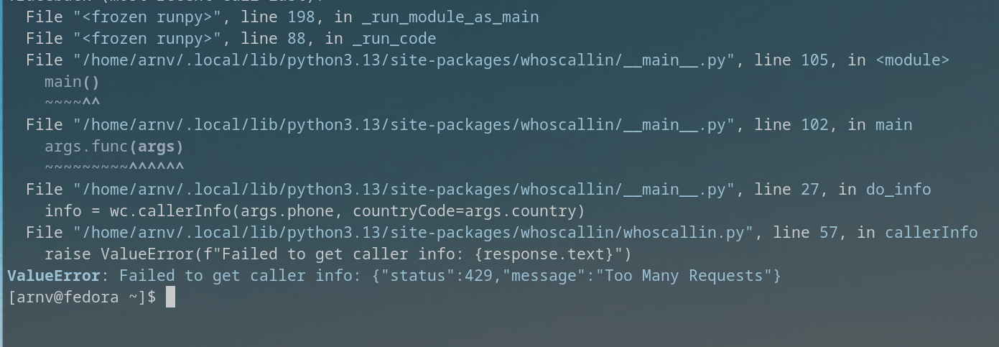

# whoscallin

Whoscallin is a POC that aims to Reverse Engineer the Truecaller Web API to get the caller ID of a phone number.
**NOTE: It is reccomended to have multiple Truecaller accounts, since Truecaller rate limits the number of requests you can make with a single account.**



## Installation
Assuming you have `uv` installed.
```bash
pip install git+https://github.com/NotoriousArnav/WhosCallin.git
# or the following command if you are using uv
uv pip install git+https://github.com/NotoriousArnav/WhosCallin.git
```
Or you can clone the repository and install it manually:
```bash
git clone https://github.com/NotoriousArnav/WhosCallin.git
cd WhosCallin
uv build
cd dist
pip install whoscallin-0.1.0-py3-none-any.whl
```

## Usage
### CLI
```bash
$ whoscallin -h
usage: __main__.py [-h] {login,info,token} ...

WhosCallin CLI - Lookup caller info using the Truecaller API (unofficial).

positional arguments:
  {login,info,token}
    login             Login and save token
    info              Lookup caller info by phone number
    token             Show or set the saved token

options:
  -h, --help          show this help message and exit
```

### As a Module
```python
from whoscallin import WhosCallin

wc = WhosCallin('your token here')
# or
wc = WhosCallin.login('911234567890')  # phone number in E.164 format

result = wc.callerInfo('911234567890')  # phone number in E.164 format

# result is a `CallerInfo`` Pydantic model. Refer [Here](schemas/__init__.py) for the schema.
```
## TODO
- [ ] Add tests for the CLI and module.
- [ ] Add Proper Documentation.

## Contributing
If you want to contribute, feel free to open an issue or a pull request. Any contributions are welcome!

## License
This Project is Unlicensed, because I know Truecaller will break this Project at some point. If I find myself in a position to maintain this project, I will license it under the GPL v3 License.
Until then, feel free to use it as you wish.
